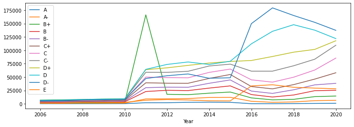

# Kcse-Data-Analysis
Data science project for exploratory analysis on the kcse grades dataset (Kamilimu Data Science Track)
## Findings

The performance of all candidates (both male and female) increased from the year 2006- 2015

In 2016 the performance decreased drastically for all candidates

There is an increase in the number of total candidates over the past years.

The total number of male candidates is higher than female candidates from the year 2006 - 2015.

In 2016, the number of female candidates is higher than the number of male candidates.

The number of quality grades is lower than the number of non quality grades over the years.

The percentage of quality grades of male candidates is higher than that of female candidates over the years.
The percentage of non quality grades of male candidates is lower than that of female candidates over the years

The most common grade scored by all candidates over the years is D and D-

### Exception observation  (What caught my eye)

In 2016:
Total number of female candidates is higher than male candidates.

Total number of quality grades in female candidates is higher than that of male candidates.
Total number of non quality grades in female candidates is higher than that of male candidates.

In 2011:

1. There's a sharp increase in  the total number of candidates

2. There's a sharp increase in the total number of candidates who scored grade B+

3. There's a huge gap difference between the total number of male and female candidates

## Conclusion

The number of candidates increases over the years.

Number of quality grades is lower than the number of non quality grades irrespective of the gender.

Generally, the number of male candidates is higher than the number of female candidates.

Male candidates perform better than the female candidates

More male candidates meet the cut off points compared to female candidates over the past years.

